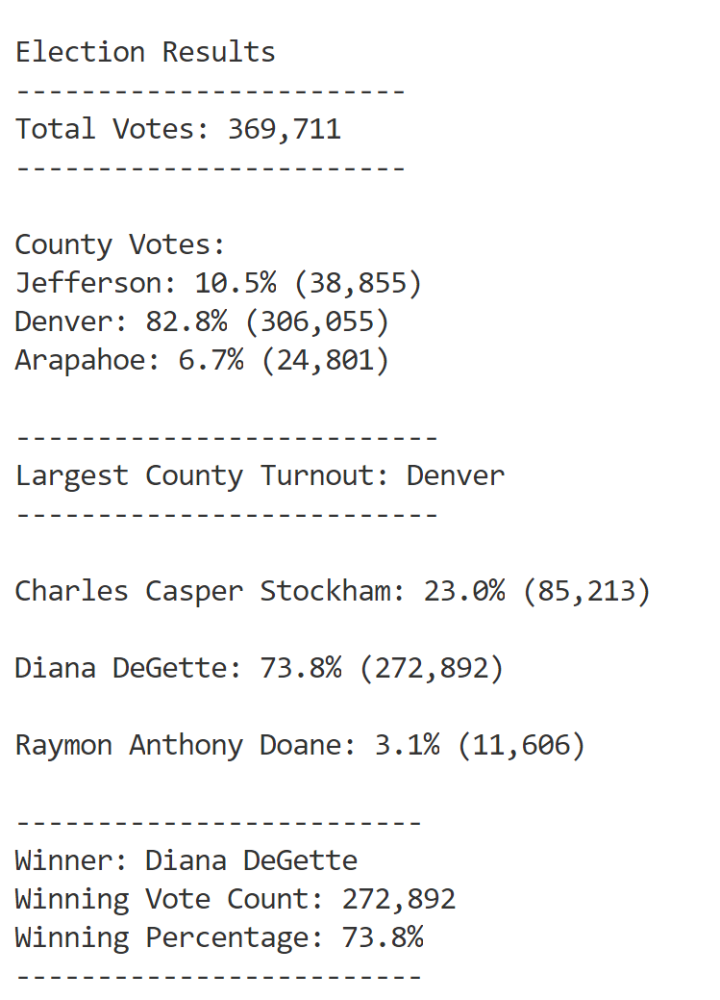
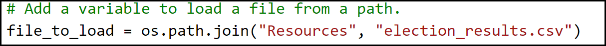
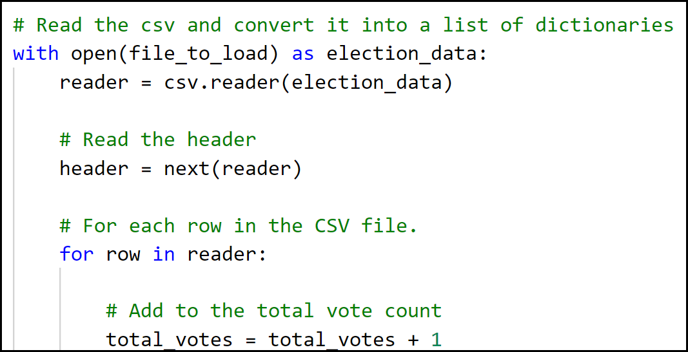
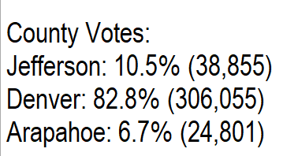
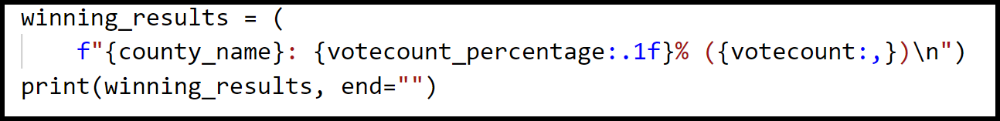
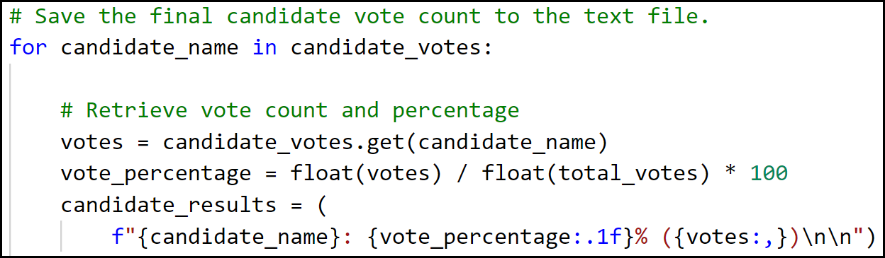
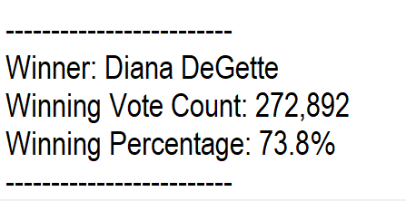
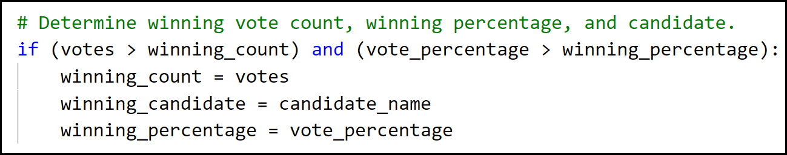

# Election_Analysis

# Project Overview
Tom at the Colorado Board of Elections has assigned tasks to complete an election audit of a recent local
congressional election. 
  1) Calculate the total number of votes cast.
  2) Get a complete a list of candidates who received votes.
  3) Calculate the total number of votes each candidate received.
  4) Calculate the percentage of votes each candidate won.
  5) Determine the winner of the election based on popular vote.
  
 # Resources
  Data Source: election_results.csv
  Softwarey: Python 3.7.6,  Visual Studio Code 1.53.2
  
  # Summary
  The analysis of the election show that:
  
  There were 369,711 votes cast in the election.
  The candidates were:
      Charles Casper Stockham
      Diane DeGette
      Raymon Anthony Doane
  The candidate results were:
      Charles Casper Stockam received 23% of the vote and 85,213 number of votes.
      Diana DeGette received 73.8% of the vote and 272,892 number of votes.
      Raymon Anthony Doane received 3.1% of the vote and 11,606 number of votes.
  The winner of the election Diane DeGette, who received 73.8% of the vote and 272,892 number of votes.
    
# Challenge Overview

# PyPoll Challenge (Module 3) Completed

## 1. Overview of Election Audit:

      Purpose of this analysis is to assist a Colorado Board of Elections employee (Tom) to provide election
      results for auditing specific congressional precincts and report the total votes cast, total votes for
      each candidate, the percentage of votes for each candidate and the winner of the election. The audit 
      is typically done in Excel using the election data provided in a comma delimited file however Tom's
      manager wants it automated using Python to process the results. If using Python is successful, 
      this automation will be used to audit other congressional districts, senatorial districts and local elections.

## 2. Election-Audit Results:

      Specific screen shots taken from the election_results.txt file.
      Coding specific shots (shown with borders) taken from the Python source code **PyPoll_Challenge.py**.
      The summary output as follows.

          
                    
      - How many votes were cast in this congressional election?
        A total of 369,711 votes were cast in the three counties.
        All records in the **election_results.csv** file were read by the Python script.

            
                   
            

      - Provide a breakdown of the number of votes and the percentage of total votes for each country in the precinct.
        Votes were counted and summarized by county.
        Total vote count and percentage of total votes is provided.

             

      - Which county had the largest number of votes?
        Votes were accumulated when details read by county.
        The largest county turnout was for **Denver**.

              

              

      - Provide a breakdown of the number of votes and the percentage of the total votes each candidate received.

             

             

      - Which candidate won the election, what was their vote count, and what was their percentage of the total votes?
        The winning candicate was Diana DeGette with vote count of 272,892 and percentage 73.8.

             

             

 
## 3. Election Audit Summary:

      This Python script provided all the required information: total votes cast, votes by county, largest
      turnout by county, total votes for each candidate, percentage of votes for each candidate and the 
      winner of the election.

      With some modifications, the Python script can be used for any election. Two are listed below.

      1.	Modify script to read input file using different path or filename. 
      For the input or output files, modify path and filename in the os.path.join details.
      The field delimiter can also be specified i.e. a ‘|’.
      
        file_to_load = **os.path.join("Resources", "election_results.csv")**
        file_to_save = **os.path.join("analysis", "election_results.txt")**

      2.	The format of the election_results.csv file included three columns: Ballot ID, County, Candidate
      Files containing different heading columns will need changing to reflect these headings.
      The script includes the **import csv** module for processing a CSV file.

   
    
## End of Summary
